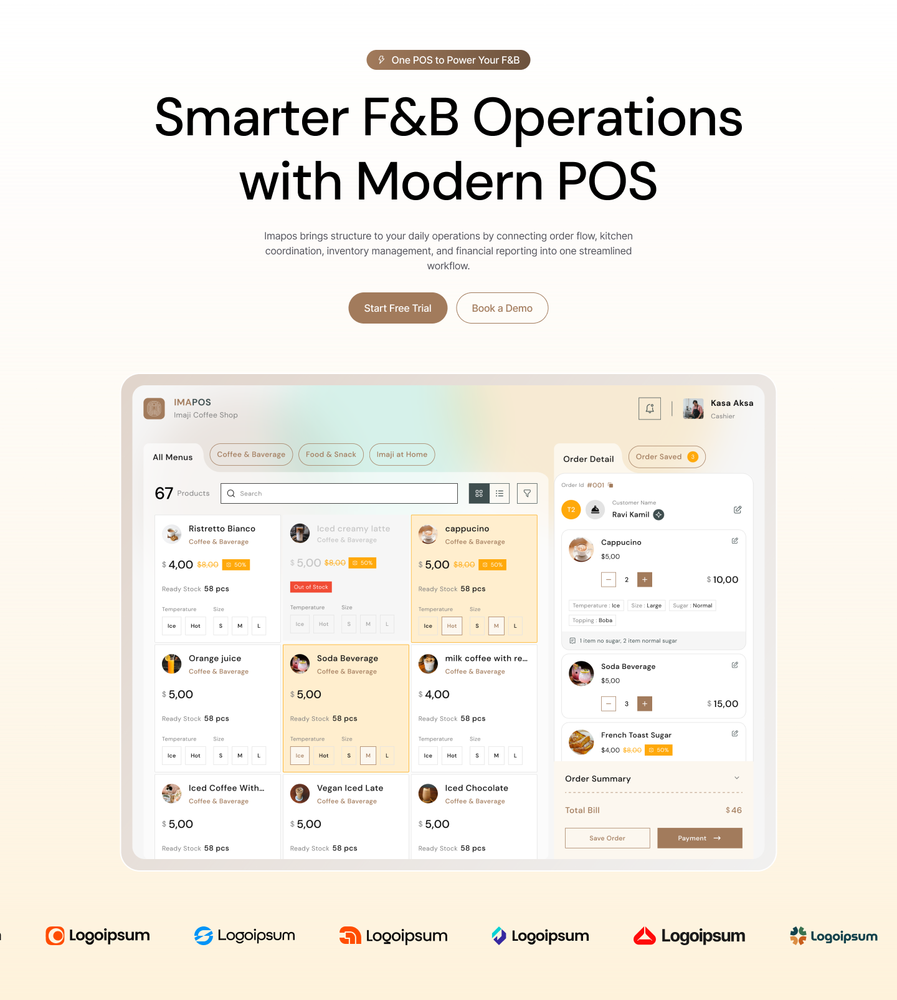
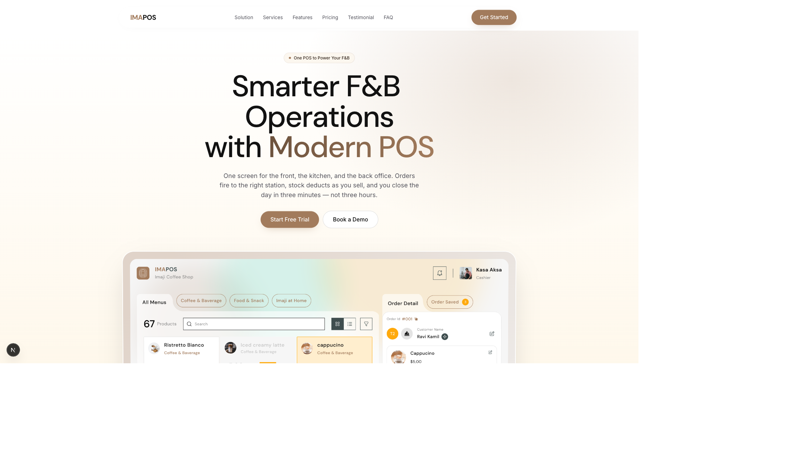
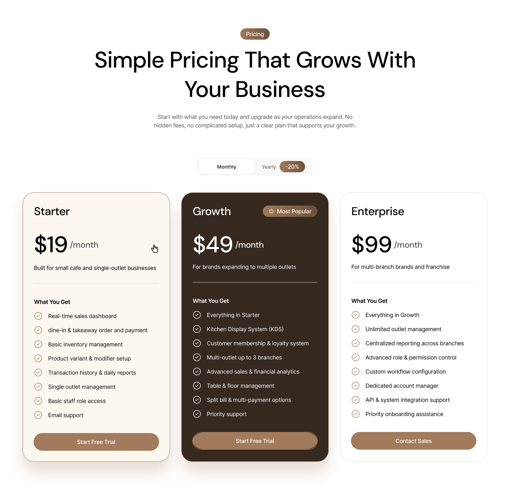
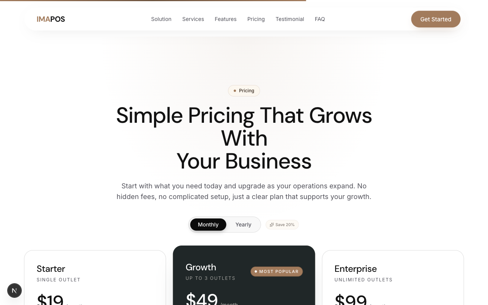
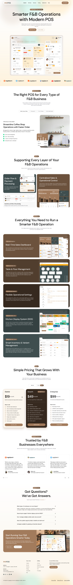

# Imapos

A production-grade F&B POS SaaS landing page — re-implemented from scratch in **Next.js 16** with deliberate UX upgrades over the original design source.

> Built as a portfolio piece: take a polished Webflow template, rebuild it in modern React/Next, and push the interaction design further than the source. Honest attribution at the bottom.

**Live demo:** [imapos.vercel.app](https://imapos.vercel.app)
**Repo:** [github.com/chrstphrpond/imapos](https://github.com/chrstphrpond/imapos)

---

## Screenshots

| Figma reference | Implementation |
| --- | --- |
|  |  |
|  |  |

Full desktop reference: 

---

## Stack

| Layer | Choice |
| --- | --- |
| Framework | **Next.js 16** App Router (Turbopack dev + build) |
| UI | **React 19**, **Tailwind CSS v4** (CSS-first config, `@theme` in `globals.css`) |
| Motion | **motion.dev v12** (formerly Framer Motion) + **GSAP 3** for ScrollTrigger-bound timelines |
| Fonts | `next/font` — **DM Sans** (display) + **Inter** (UI body) |
| Icons | **lucide-react v1** |
| Assets | **Vercel Blob** for hero/iPad/brand visuals (CDN-cached, 30-day immutable headers) |
| Email | **Resend** for the contact form (`/api/contact`) |
| Hosting | **Vercel** (Edge network + Web Analytics) |
| Package manager | **pnpm 10** |
| Node | **24.x** |

---

## Architecture decisions

A few choices worth flagging — each one is intentional, not the default:

### 1. `motion.dev` v12 over Framer Motion v11 or pure GSAP

`motion` is the same team and API surface as Framer Motion, but ships as the renamed standalone package with a smaller core and direct DOM hooks (`useScroll`, `useTransform`) that compose cleanly with React 19's concurrent rendering. GSAP is still pulled in — but only for **ScrollTrigger** sequences (the iPad parallax + stats count-up), where its scrubbing is unmatched. Two tools, each used where it dominates.

### 2. Vercel Blob for assets — not `/public`

The hero iPad render, brand SVGs, and screenshots all live in Vercel Blob, served from a separate origin with `cache-control: public, max-age=2592000, immutable` (30-day edge cache). The reasons:

- Keeps the deployed bundle small — `/public` ships on every deploy regardless of churn.
- Decouples asset rotation from code rotation — swap a hero render without a redeploy.
- Edge cache lives on Vercel's CDN, not just the build artifact, so cold-region TTFB for media improves measurably.

### 3. `unoptimized` on the hero image — documented edge case

`next/image` with default optimization produces a `srcset` referencing internal `/_next/image?...` URLs. On dev (Turbopack), the `srcset` can desync when the source is a remote Blob with cache-busting query strings, causing flashes on first paint. Flipping `unoptimized` on the hero (only) trades a single Blob-served WebP for deterministic dev/prod parity. The image is already pre-sized and AVIF/WebP encoded at source, so the loss is marginal and the dev DX is much better.

### 4. DM Sans + Inter via `next/font/google`

DM Sans handles display copy (h1–h3, hero, section headers) for its slightly warmer geometric feel that matches an F&B brand. Inter takes UI body, captions, and form labels for legibility at small sizes. Both are self-hosted via `next/font`, so no runtime Google Fonts requests — eliminates a render-blocking third-party and gets us zero CLS from font swap.

### 5. Custom F&B brand SVGs vs stock logos

The trust strip below the hero uses **8 hand-built brand SVGs** (cafes, cloud kitchens, multi-outlet QSR concepts) instead of generic placeholder logos. They communicate the niche immediately — viewers don't need to read the H2 to know who this product is for. Built thin, mono-color, sized to optical balance, and rendered through an infinite marquee with `prefers-reduced-motion` fallback.

---

## What was built beyond the source

The Webflow source is a strong static design. This rebuild adds real interaction design on top:

- **8 custom F&B brand SVGs** + reduced-motion-aware infinite marquee
- **Character-stagger hero text reveal** with a one-shot gradient sweep across the words "Modern POS"
- **iPad mouse-tilt parallax** (pointer-driven 3D rotateX/rotateY) plus a scroll-bound translateY/scale lifting the device as you scroll past
- **Animated stats band** with viewport-triggered count-up
- **Magnetic CTA buttons** — pointer-magnetism with spring physics, disabled on touch/coarse pointers
- **Top scroll-progress bar** with subtle scale-in on initial load
- **Animated conic-gradient border** on the featured pricing plan — pure CSS `@property` + `linear-gradient(from var(--angle))` rotation
- **Bento Features explored then reverted to a stacked layout** because the source's bento grid actually disrupted scan flow at common viewports — kept the visual polish, lost the busy
- **Full a11y**: skip-to-content link, ARIA tab + accordion patterns, `:focus-visible` focus rings on every interactive surface, full `prefers-reduced-motion` respect across every animation
- **SEO essentials**: dynamic OG image via `ImageResponse` (edge), sitemap, robots, custom 404, full canonical/Twitter/OpenGraph metadata
- **6 supporting pages**: `/privacy`, `/terms`, `/cookies`, `/security`, `/status`, `/integrations`, `/docs`, `/changelog` — every footer link resolves to a real page, not a `#`

---

## Performance

Lighthouse — desktop preset, single run against [imapos.vercel.app](https://imapos.vercel.app):

| Category | Score |
| --- | --- |
| Performance | 83 |
| Accessibility | 93 |
| Best Practices | 100 |
| SEO | 100 |

Raw report: [`docs/lighthouse.json`](./docs/lighthouse.json) · Summary: [`docs/lighthouse-summary.md`](./docs/lighthouse-summary.md).

Performance is the obvious next win — the hero ships motion/GSAP eagerly on first paint. Deferring those bundles + further squeezing the iPad render are the two biggest levers.

---

## Local development

```bash
# Install
pnpm install

# Secrets are managed via Doppler (no .env files in the repo)
doppler setup        # link this dir to project: imapos / config: dev
doppler run -- pnpm dev

# Build + start (production)
doppler run -- pnpm build
doppler run -- pnpm start
```

Required secrets (configured in Doppler):

| Key | Purpose |
| --- | --- |
| `RESEND_API_KEY` | Contact form delivery |
| `BLOB_READ_WRITE_TOKEN` | Vercel Blob for asset reads (auto-provisioned on Vercel) |

If you don't have Doppler, fall back to a local `.env.local` with the same keys — the app reads `process.env` directly.

---

## Deploy

```bash
# Preview
vercel

# Production
vercel --prod
```

The repo is already linked to project `imapos` (team `crit-projects`). Doppler's Vercel Marketplace integration auto-syncs the `prd` config — no env vars are managed in the Vercel dashboard directly.

---

## Project layout

```
src/
  app/                  Next.js App Router
    api/contact         Resend-backed contact form handler
    (info pages)        privacy, terms, cookies, security, integrations, docs, status, changelog
    layout.tsx          root layout — fonts, nav, footer, analytics
    opengraph-image.tsx Edge-rendered dynamic OG image
    sitemap.ts          Dynamic sitemap
    robots.ts           Robots policy
  components/
    layout/             Navbar, Footer
    sections/           Hero, Solution, Features, Services, Pricing, Stats, Testimonial, FAQ, LogoStrip
    ui/                 Button, MagneticButton, Container, Eyebrow, Logo, SectionHeader, ScrollProgress, infinite-slider
    visuals/            Brands (custom SVGs), HeroTilt (parallax + tilt)
  lib/                  Shared utilities
docs/
  screenshots/          Reference + implementation captures
  lighthouse.json       Raw Lighthouse report
  lighthouse-summary.md Per-category score table
```

---

## Attribution

The visual design is a re-implementation of **Arsakami's F&B POS SaaS template** (originally published on the Webflow community marketplace). Layout, typography rhythm, brand palette, and section structure follow the source; everything in this repo — every component, every animation, every page — was authored from scratch in Next.js with significant interaction-design upgrades documented above.

If you're the original designer and would like additional credit (or for this to come down), please open an issue.

---

## Author

**Christopher Pond** — [github.com/chrstphrpond](https://github.com/chrstphrpond)

Portfolio rebuild. Open to feedback, PRs, and conversations about modern React/Next interaction design.

---

## License

MIT. Use the code freely. The visual design intent is credited to Arsakami above — please honor that if you copy the look.
